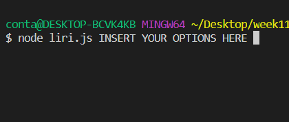

# liri-node-app
<h1>LIRI</h1>

LIRI (Language Interpretation and Recognition Interface) understands your commands and performs useful tasks like SIRI.

<h3>Technologies Used</h3>
Javascript, Bands in town api, spotify api, omdb api.
<h3>How to Run</h3>
To run LIRI, you will need Bash, Node, and npm.
<ol>
<li>In Bash, type git clone git@ github.com/nebiyouk/liri-node-app.git to download LIRI.</li>
<li>Then, type cd liri-node-app; npm install to download the required packages.</li>
<li>Change the file name of keys_template.js to keys.js. Open this file to add your API keys for Twitter, Spotify, and OMDB.</li>
<li>In Bash, type node liri.js to start the program. Please read below for the options.</li>
</ol>

<strong>Options = movie-this, concert-this or spotify-this-song.</strong>
<h3>Demos - Spotify This Song</h3>
Type node liri.js spotify-this-song "SONG NAME" to find the artist and album information.

<h3>Demos - Movie This</h3>
Type node liri.js movie-this<strong> "MOVIE NAME" </strong> to find the movie information.

<h3>Demos - Concert This</h3>
Type node liri.js concert-this <strong>"ARTIST NAME"</strong> to find the concert information.

